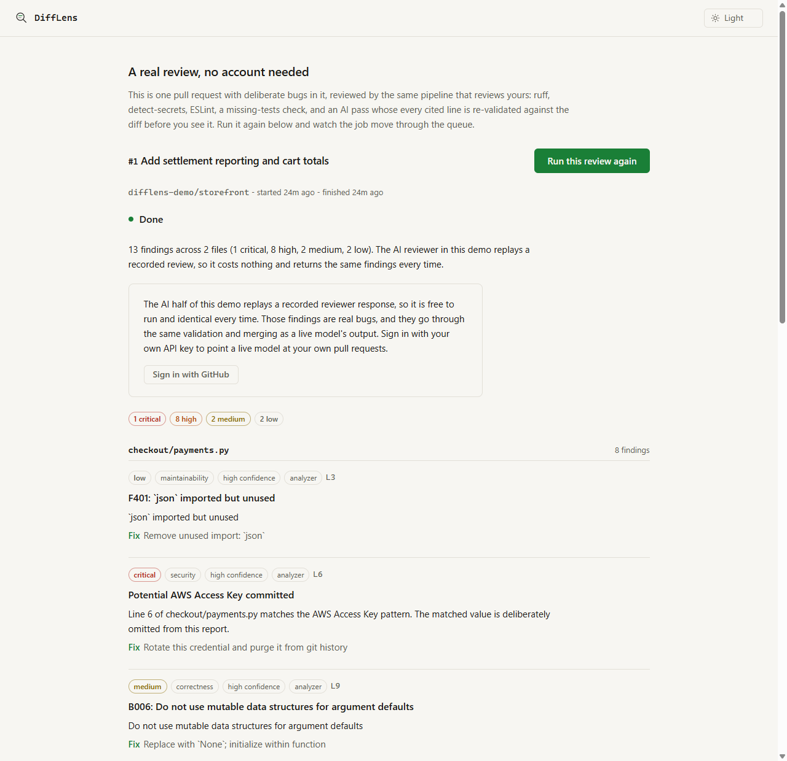
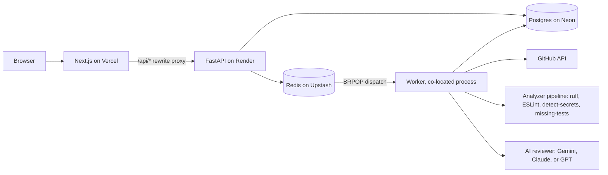

# DiffLens

[](https://github.com/AnirudIye/difflens/actions/workflows/ci.yml)

DiffLens is an AI code review platform for GitHub pull requests and whole repositories. It pairs deterministic static analysis (ruff, ESLint, detect-secrets, a missing-tests heuristic) with an AI reviewer behind a provider abstraction (Gemini, Anthropic, or OpenAI, plus a mock that needs no key), then verifies every file and line the AI cites against the exact commit it reviewed, so hallucinated findings never reach you. Sign in with GitHub OAuth (read-only, public repos), pick a pull request or a repository, and an async pipeline built on FastAPI and Next.js fetches the diff or the repository snapshot, runs the analyzers, dedupes the results, and renders findings with severity, category, confidence, and a concrete recommendation.

**[See a review without signing in](https://difflens-zeta.vercel.app/demo)** - one pull request with deliberate bugs in it, reviewed by the real pipeline. No account, no API key. The free tier sleeps, so give the first request up to a minute.

<picture>
  <source media="(prefers-color-scheme: dark)" srcset="docs/images/demo-review-dark.png">
  
</picture>

*The public demo at `/demo`. Every finding is pinned to a file and a line, and carries the analyzer or model it came from.*

## What it does

- Signs in with GitHub OAuth using a deliberately empty scope: read-only, public repos only. DiffLens never asks for write access.
- Pins every review to immutable SHAs (base and head for a pull request, the default branch's head for a repository), so the review describes one exact snapshot even if the branch moves afterward.
- Reviews a whole repository at its default branch head, not just pull requests. The worker ingests the repository tarball defensively under hard ceilings (20,000 files, 200 MB extracted) and refuses an oversized repository honestly rather than reviewing a truncated tree. The AI reads the tree in chunks: up to 40 with your own key, a single chunk without one, and the review states exactly how many files the AI covered. The missing-tests heuristic stays PR-only, since with every line counted as changed it would flag every repository without a test file.
- Runs deterministic analyzers: ruff for Python, ESLint for TypeScript and JavaScript, detect-secrets for leaked credentials, and a missing-tests heuristic. Both linters run isolated from the reviewed repository's own configuration, because a lint config can load plugins and a plugin is code.
- Runs an AI reviewer through a provider abstraction with a mock mode, so the whole pipeline works locally and in CI without an API key.
- Validates every AI-cited file and line against the reviewed snapshot and discards locations that do not exist. Hallucinations get filtered, not rendered.
- Treats PR content as untrusted input to the AI reviewer; prompt-injection defense is part of the pipeline design, not a patch.
- Dedupes findings across analyzers and the AI with content-based fingerprints.
- Persists each finding with severity, category, confidence, source, and recommendation, and lets you mark findings as helpful or wrong.
- Runs a public demo at `/demo` that a visitor with no account can read and re-run. It goes through the same queue, worker, analyzers, and validation chain as any other review; only the diff source and the AI response are bundled, so it costs nothing per run.

## Architecture



Everything runs on free tiers: Vercel for the Next.js 15 frontend, Render for the FastAPI API with the worker supervised in the same container, Neon for Postgres, Upstash for the Redis dispatch queue. Postgres holds job state as the source of truth; Redis is just the doorbell. Total infrastructure cost: $0.

## Design decisions

The decisions that shaped everything else are written down as ADRs, each with the
alternatives that lost and the costs that were accepted:

- [001: Redis dispatches, Postgres is the truth](docs/adr/0001-queue-redis-dispatch-postgres-truth.md) - why the queue is hand-rolled instead of Celery, and the free-tier command budget that decided it.
- [002: GitHub OAuth with an empty scope](docs/adr/0002-github-oauth-empty-scope.md) - why a review tool should not be able to write to your repository.
- [003: The browser only ever talks to one origin](docs/adr/0003-session-via-next-rewrite-proxy.md) - the rewrite proxy, and the third-party cookie problem it avoids.
- [004: Treat the AI provider and its output as untrusted](docs/adr/0004-provider-abstraction-and-output-validation.md) - the provider abstraction and the validation chain that discards hallucinated locations.
- [005: A repository snapshot is a review target, not a synthetic pull request](docs/adr/0005-repository-snapshot-reviews.md) - the target union, the tarball ceilings that refuse rather than truncate, and the chunked AI tiers that keep a repository review from starving the shared key.
- [006: Precision at repository scale is a filter problem, not a tuning problem](docs/adr/0006-snapshot-precision.md) - why reviewing a whole repository turned the deterministic analyzers into noise, and what replaced the filter that a diff used to provide.

The frozen scope and the descope ladder are in [docs/SCOPE.md](docs/SCOPE.md), annotated in place
where the sprint diverged from it.

## Status

Built in 10 days, start to finish. Live at https://difflens-zeta.vercel.app

- [x] Day 1: repo scaffold, CI, scope and architecture docs
- [x] Day 2: database schema and GitHub OAuth
- [x] Day 3: GitHub integration and first deploy
- [x] Day 4: deterministic analyzers
- [x] Day 5: worker and queue (descope checkpoint passed, nothing cut)
- [x] Day 6: AI review layer
- [x] Day 7: review UI
- [x] Day 8: tests, security pass, threat model
- [x] Day 9: demo mode and hardening
- [x] Day 10: portfolio polish

Repository snapshot reviews were added after the sprint, on 2026-08-24 (ADR 005).

## What is not built

Naming these is part of the point. Each was a decision, not an oversight:

- **Private repositories.** They need a GitHub App. The OAuth `repo` scope is read and write, so
  asking for it would mean asking for permission to push, which contradicts the whole posture.
- **Posting findings back as PR comments.** Same reason: it needs write access.
- **Webhooks and auto-review.** v1 is user-triggered. Webhook ingress is GitHub App territory too.
- **Executing the reviewed code.** Reviews are static only. Running untrusted code is a different
  product with a different threat model.
- **A review history page.** Reviews are reachable by the redirect after you start one, and a
  repository's page links its latest snapshot review. There is still no listing endpoint.
- **Account deletion, data export, and a Content-Security-Policy.** All three are named as
  accepted gaps in [the threat model](docs/THREAT_MODEL.md), with the reason each was accepted.
- **Languages beyond Python and TypeScript/JavaScript.** Every language multiplies analyzer work
  and two are enough to prove the design.

Only the Gemini provider has been exercised against a live API. Anthropic and OpenAI are built and
tested against recorded responses, which is stated here rather than left for you to discover.

## Local development

Prerequisites: Docker Desktop, Node 20+, and [uv](https://docs.astral.sh/uv/).

First, copy the env template and fill in what you need (mock AI mode needs no keys):

```
copy .env.example .env
```

Start Postgres and Redis:

```
docker compose up -d
```

Run the API:

```
cd api
uv sync
uv run uvicorn app.main:app --reload
```

Run the frontend in a second terminal:

```
cd web
npm install
npm run dev
```

Run the worker in a third terminal, or reviews queue and never start:

```
cd api
uv run python -m worker
```

Or skip the terminals: `run-api.cmd`, `run-worker.cmd`, and `run-web.cmd` at the repo root launch each part in its own window (they use the venv at `api\.venv`, so run `uv sync` once first).

To see the demo locally, set `DEMO_MODE=1` in `.env`, seed it once with `uv run python -m app.demo.seed` from `api/`, and open http://localhost:3000/demo.

The databases live in Docker; the API and web app run natively for fast reloads. Postgres publishes on host port 55432 (not 5432) so it never collides with a locally installed PostgreSQL. `docker compose --profile full up -d` additionally builds and runs the API in a container if you want to exercise that path.

## Security

The threat model is written down, including the parts that are not mitigated: [docs/THREAT_MODEL.md](docs/THREAT_MODEL.md). Reviewed pull request content is untrusted input throughout, which is the assumption most of the design follows from.

## Deployment

Production runs on free tiers: Vercel for the frontend, Render for the API (Docker, driven by `render.yaml` at the repo root), Neon for Postgres. The full runbook, including the env var table and the deploy order that untangles the OAuth callback circular dependency, is in [docs/DEPLOYMENT.md](docs/DEPLOYMENT.md).

## License

MIT. See [LICENSE](LICENSE).

Last updated: 2026-08-24
