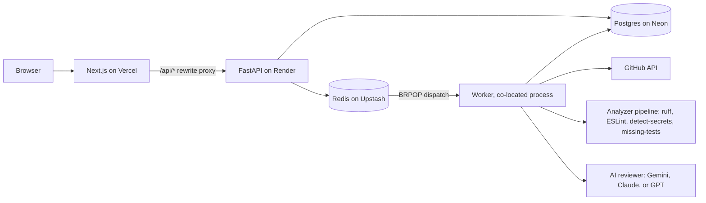

# DiffLens

[](https://github.com/AnirudIye/difflens/actions/workflows/ci.yml)

DiffLens is an AI code review platform for GitHub pull requests. It pairs deterministic static analysis (ruff, ESLint, detect-secrets, a missing-tests heuristic) with an AI reviewer behind a provider abstraction (Gemini, Anthropic, or OpenAI, plus a mock that needs no key), then verifies every file and line the AI cites against the exact commit it reviewed, so hallucinated findings never reach you. Sign in with GitHub OAuth (read-only, public repos), pick a pull request, and an async pipeline built on FastAPI and Next.js fetches the diff, runs the analyzers, dedupes the results, and renders findings with severity, category, confidence, and a concrete recommendation.

## What it does

- Signs in with GitHub OAuth using a deliberately empty scope: read-only, public repos only. DiffLens never asks for write access.
- Pins every review to immutable base and head SHAs, so the review describes one exact snapshot even if the branch moves afterward.
- Runs deterministic analyzers: ruff for Python, ESLint for TypeScript and JavaScript, detect-secrets for leaked credentials, and a missing-tests heuristic. Both linters run isolated from the reviewed repository's own configuration, because a lint config can load plugins and a plugin is code.
- Runs an AI reviewer through a provider abstraction with a mock mode, so the whole pipeline works locally and in CI without an API key.
- Validates every AI-cited file and line against the reviewed snapshot and discards locations that do not exist. Hallucinations get filtered, not rendered.
- Treats PR content as untrusted input to the AI reviewer; prompt-injection defense is part of the pipeline design, not a patch.
- Dedupes findings across analyzers and the AI with content-based fingerprints.
- Persists each finding with severity, category, confidence, source, and recommendation, and lets you mark findings as helpful or wrong.

## Architecture



Everything runs on free tiers: Vercel for the Next.js 15 frontend, Render for the FastAPI API with the worker supervised in the same container, Neon for Postgres, Upstash for the Redis dispatch queue. Postgres holds job state as the source of truth; Redis is just the doorbell. Total infrastructure cost: $0.

## Status

Day 8 of a 10-day build. Live at https://difflens-zeta.vercel.app

- [x] Day 1: repo scaffold, CI, scope and architecture docs
- [x] Day 2: database schema and GitHub OAuth
- [x] Day 3: GitHub integration and first deploy
- [x] Day 4: deterministic analyzers
- [x] Day 5: worker and queue (descope checkpoint passed, nothing cut)
- [x] Day 6: AI review layer
- [x] Day 7: review UI
- [x] Day 8: tests, security pass, threat model
- [ ] Day 9: demo mode and hardening
- [ ] Day 10: portfolio polish

## Local development

Prerequisites: Docker Desktop, Node 20+, and [uv](https://docs.astral.sh/uv/).

First, copy the env template and fill in what you need (mock AI mode needs no keys):

```
copy .env.example .env
```

Start Postgres and Redis:

```
docker compose up -d
```

Run the API:

```
cd api
uv sync
uv run uvicorn app.main:app --reload
```

Run the frontend in a second terminal:

```
cd web
npm install
npm run dev
```

Or skip the terminals: `run-api.cmd` and `run-web.cmd` at the repo root launch each half in its own window (the API one uses the venv at `api\.venv`, so run `uv sync` once first).

The databases live in Docker; the API and web app run natively for fast reloads. Postgres publishes on host port 55432 (not 5432) so it never collides with a locally installed PostgreSQL. `docker compose --profile full up -d` additionally builds and runs the API in a container if you want to exercise that path.

## Security

The threat model is written down, including the parts that are not mitigated: [docs/THREAT_MODEL.md](docs/THREAT_MODEL.md). Reviewed pull request content is untrusted input throughout, which is the assumption most of the design follows from.

## Deployment

Production runs on free tiers: Vercel for the frontend, Render for the API (Docker, driven by `render.yaml` at the repo root), Neon for Postgres. The full runbook, including the env var table and the deploy order that untangles the OAuth callback circular dependency, is in [docs/DEPLOYMENT.md](docs/DEPLOYMENT.md).

## License

MIT. See [LICENSE](LICENSE).

Last updated: 2026-08-20
